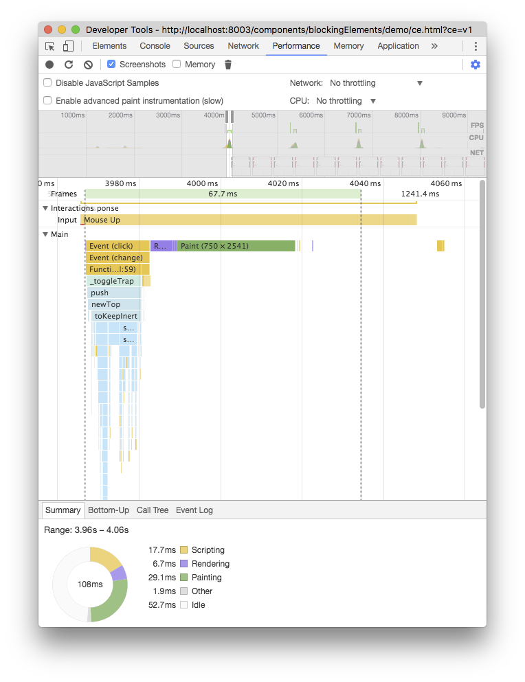
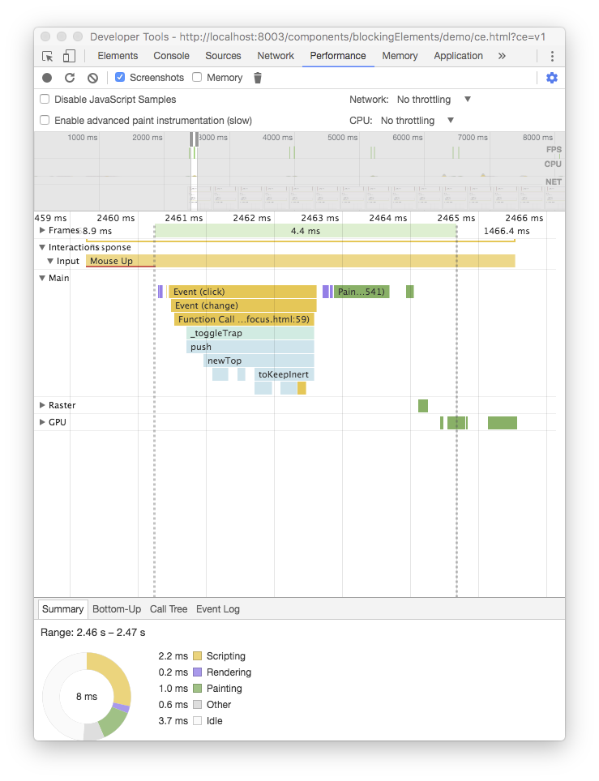
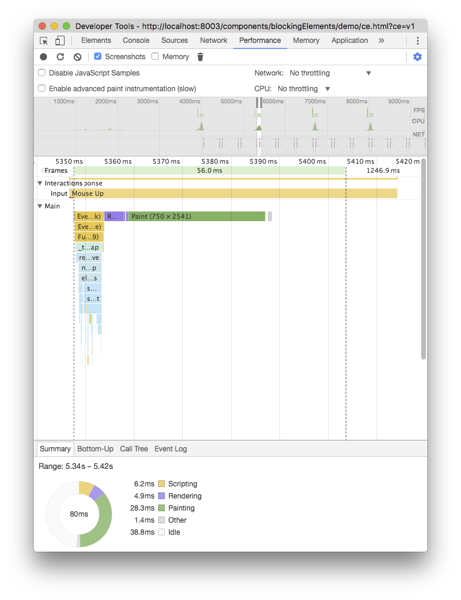
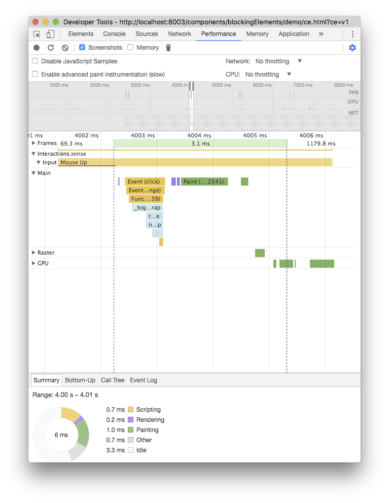
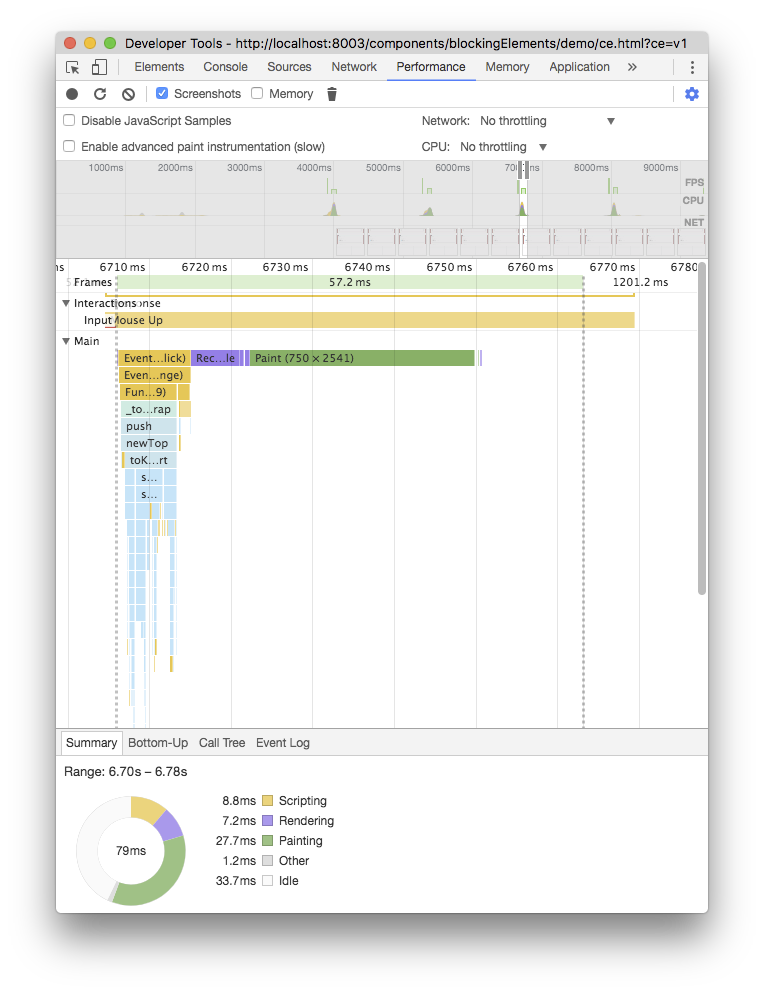
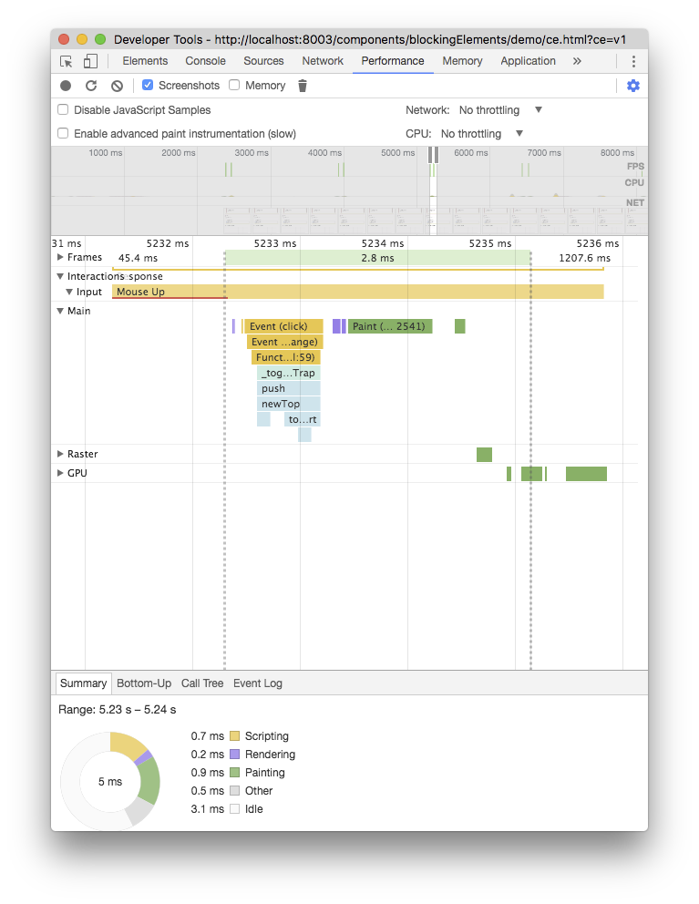
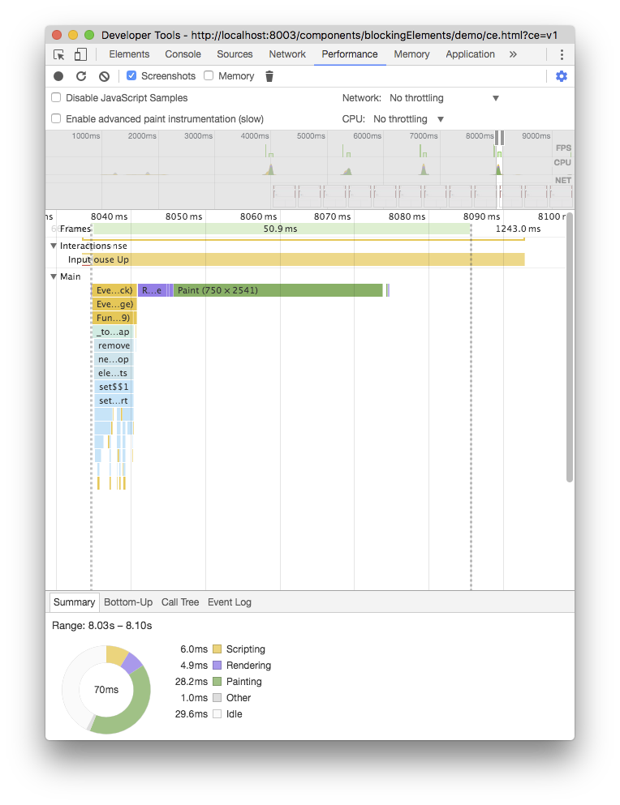
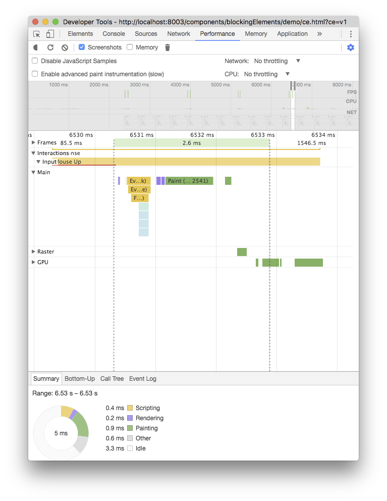

[](https://travis-ci.org/PolymerLabs/blockingElements)

# `blockingElements` stack API

Implementation of proposal <https://github.com/whatwg/html/issues/897>

`document.$blockingElements` manages a stack of elements that inert the interaction outside them.

- the stack can be updated with the methods `push(elem), remove(elem), pop(elem)`
- the top element (`document.$blockingElements.top`) and its subtree is the interactive part of the document
- `has(elem)` returns if the element is a blocking element

This polyfill will:

- search for the path of the element to block up to `document.body`
- set `inert` to all the siblings of each parent, skipping the parents and the element's distributed content (if any)

Use this polyfill together with the [WICG/inert](https://github.com/WICG/inert) polyfill to disable interactions on the rest of the document. See the [demo page](https://github.com/PolymerLabs/blockingElements/blob/master/demo/index.html) as an example.

## Why not listening to events that trigger focus change?

Another approach could be to listen for events that trigger focus change (e.g. `focus, blur, keydown`) and prevent those if focus moves out of the blocking element.

Wrapping the focus requires to find all the focusable nodes within the top blocking element, eventually sort by tabindex, in order to find first and last focusable node.

This approach doesn't allow the focus to move outside the window (e.g. to the browser's url bar, dev console if opened, etc.), and is less robust when used with assistive technology (e.g. android talkback allows to move focus with swipe on screen, Apple Voiceover allows to move focus with special keyboard combinations).

## Install & run locally

Install the dependencies with `bower install`.

Serve the resources via the [polymer CLI](https://github.com/Polymer/polymer-cli):
```bash
$ npm install -g polymer-cli
$ polymer serve
```

## Performance

Performance is dependent on the `inert` polyfill performance. Chrome recently landed [the `inert` attribute implementation](https://codereview.chromium.org/2088453002/) behind a flag.

Let's compare the how long it takes to toggle the deepest `x-trap-focus` inside nested `x-b` of the demo page (<http://localhost:8080/components/blockingElements/demo/ce.html?ce=v1>) .

`blockingElements` with native inert is **~15x faster** than polyfilled inert 🎉 🎉 🎉

| with polyfilled inert (M58) | with native inert (M60) |
|----------|--------|
|  |  |
|  |  |
|  |  |
|  |  |
